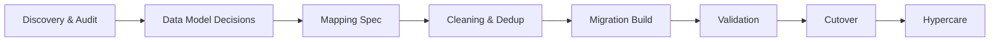

> [!summary] CRM Migration Playbook
> Data migration is not a file transfer. It is the process of moving information from one system to another while protecting structure, meaning, and operational trust.
>
> **Use this when:** you need a repeatable way to scope, execute, and sign off on a CRM migration with defined success criteria and minimal disruption.
>
> **Not covered:** tool-specific tutorials (Salesforce, HubSpot, Blackbaud, etc.), data warehouse integrations, or real-time sync architectures.

## Scope

**Who this is for:** Operations leads, database managers, and RevOps practitioners responsible for planning or evaluating a CRM-to-CRM migration (often from spreadsheets, a legacy tool, or an underused CRM into a structured platform).

**What it enables:** A practical lifecycle you can run end-to-end with named owners, explicit artifacts, and a clear "Definition of Done".

---

## At a Glance

|Phase|Primary output|Primary owner|
|---|---|---|
|Discovery & audit|System inventory + risks log|Ops lead + data steward|
|Data model decisions|Objects/relationships + ID strategy|Ops lead + CRM admin|
|Mapping spec|Field mapping table + transformation rules|CRM admin|
|Cleaning & dedupe|Clean dataset + exclusions log|Data steward|
|Migration build|Rerunnable import scripts + staging runs|CRM admin (+ tech lead)|
|Validation|Counts, integrity checks, report parity|Ops lead + end users|
|Cutover|Freeze window + delta plan + comms|Ops lead + sponsor|
|Hypercare|Issue intake + triage + governance review|Ops lead|

---

## Why CRM Migrations Fail

In CRM work, records drive outreach, reporting, follow-up, segmentation, and decision-making. A sloppy migration creates a prettier version of the same mess.

> [!warning] Common failure modes
> - Source data is inconsistent across spreadsheets, forms, and legacy tools.
> - Field mapping is rushed or undocumented.
> - Duplicates are not resolved before import.
> - Relationships between contacts, accounts, households, donations, or cases are lost.
> - Automations, workflows, and reports are never rebuilt (so the data arrives but the system doesn't work).
> - Teams assume the new CRM will fix broken processes on its own.

> [!important] Hard truth
> A bad migration doesn't stay a migration problem. It becomes a reporting problem, a trust problem, and eventually an operations problem.

---

## Migration Lifecycle

Each phase should have a named owner and a documented completion condition before the next phase begins.

### 1. Discovery & Audit

_Owner: Ops lead + data steward_

- Inventory all source systems, files, and feeds.
- Identify the authoritative source for each object type (contacts, accounts, donations, cases, activities).
- Document data volume, age range, and update frequency.
- Flag compliance and privacy constraints: PII fields, consent records, retention policies, access controls.

**Exit criteria:** inventory complete, constraints documented, and risks logged.

### 2. Data Model Decisions

_Owner: Ops lead + CRM admin_

- Define the objects and relationships that must be preserved (e.g., person <-> organization, donor <-> donation, child <-> guardian).
- Establish a canonical ID strategy (how records will be uniquely identified and matched across systems).
- Lock picklist values, status categories, and controlled vocabulary before mapping begins.

**Exit criteria:** object model + relationship rules + ID strategy agreed.

### 3. Mapping Specification

_Owner: CRM admin_

Document every source field with a deliberate destination. The mapping spec is version-controlled and signed off before any import runs.

|Source field|Source object|Destination field|Destination object|Transformation rule|Validation rule|
|---|---|---|---|---|---|
|`first_name`|Contacts|`FirstName`|Contact|Trim, title case|Required, non-null|
|`org_name`|Contacts|`AccountName`|Account|Lookup or create|Must match Account record|
|`gift_date`|Donations|`CloseDate`|Opportunity|Parse to ISO 8601|Valid date, not future|

> [!note] Mapping rule
> If a field cannot be explained, mapped, and validated, it does not get imported blindly. Undocumented fields go into a quarantine log for review.

**Exit criteria:** mapping spec complete, reviewed, and signed off.

### 4. Cleaning & Deduplication

_Owner: Data steward_

Clean before import, not after. Post-import cleanup inside a live CRM is slower, riskier, and more disruptive.

- Standardize names, dates, phone formats, and status values.
- Apply deterministic deduplication rules (exact match on email, then fuzzy match on name + organization); document merge policy.
- Normalize categories and picklists to match destination values.
- Remove records that are obsolete, unusable, or out of retention scope.
- Log every record that is excluded and why.

**Exit criteria:** clean dataset produced, dedupe policy documented, exclusions logged.

### 5. Migration Build

_Owner: CRM admin + technical lead (if applicable)_

- Build and run all transformations in a staging environment (never directly against production).
- Use rerunnable, logged scripts (not one-off manual imports).
- Migrate in object dependency order: accounts before contacts, contacts before activities, etc.
- Preserve relationship keys throughout (dropping an account ID breaks the link).

**Exit criteria:** staging run completes with logs + repeatable scripts.

### 6. Validation

_Owner: Ops lead + representative end users_

Validation is not optional and not a spot check. It is a structured process with documented results.

- **Row counts:** Source totals match destination totals per object type.
- **Referential integrity:** All relationship links resolve (no orphaned records).
- **Field-level sampling:** Random sample of 50-100 records reviewed by users who know the data.
- **Report parity:** Key reports run in the new system and compared against baseline outputs from the source.
- **Workflow and automation testing:** Every active workflow/sequence is triggered in staging and confirmed to behave correctly.

> [!tip] Make validation boring
> Write the checks before you migrate. The goal is to reduce debate at the end.

**Exit criteria:** validation report completed and accepted.

### 7. Cutover Plan

_Owner: Ops lead + executive sponsor_

- Define the freeze window: when the source system goes read-only and no new records are entered.
- Run a final delta migration for records created/updated since the initial load.
- Confirm rollback criteria: what triggers a rollback, and who has authority to call it.
- Communicate the cutover schedule, downtime, and support channel to all teams at least one week in advance.

**Exit criteria:** cutover plan approved, comms delivered, rollback path understood.

### 8. Hypercare

_Owner: Ops lead_

The migration is not complete at go-live. Hypercare is a defined post-launch period (recommended: 2-4 weeks) with structured support.

- Dedicated intake channel for data issues and workflow failures.
- Daily triage of reported issues with 24-hour response SLA for blockers.
- Retraining sessions for teams whose workflows changed.
- Governance review at end of hypercare: issues logged, owners assigned, lessons documented.

**Exit criteria:** issue backlog triaged/owned and governance handoff completed.

---

## Definition of Done

The migration is complete when all of the following are true and signed off by the designated owner.

|Category|Threshold|Sign-off owner|
|---|---|---|
|Record migration|>= 99% of in-scope records imported without error|Data steward|
|Deduplication|0 confirmed duplicate pairs in priority object types|Data steward|
|Relationship integrity|100% of required relationship links verified via integrity check|CRM admin|
|Field mapping coverage|100% of required fields mapped; all exclusions documented|CRM admin|
|Report parity|Top 5 operational reports match baseline outputs within agreed tolerance|Ops lead|
|Workflow validation|All active automations tested and confirmed in staging|CRM admin|
|User acceptance|Sign-off from at least one representative user per team|Ops lead|
|Rollback window closed|Source system formally decommissioned or archived|Executive sponsor|

---

## Principles

1. **Move only what is useful** - define "useful" before the audit: relevant time range, required fields, compliance-permitted records.
2. **Preserve meaning, not just values** - use controlled vocabulary, normalization rules, and canonical sources to carry context across systems.
3. **Document every transformation** - the mapping spec is the record of intent; without it, you cannot audit or rerun.
4. **Validate with real users** - automated checks catch structural errors; users catch semantic ones.
5. **Treat migration as operations design** - the goal is a system people trust enough to actually use.

---

## Quick-Reference Checklist

- [ ] Audience and scope defined.
- [ ] Source systems inventoried and authoritative sources identified.
- [ ] Compliance and privacy constraints documented.
- [ ] Data model and canonical IDs confirmed.
- [ ] Mapping specification complete and version-controlled.
- [ ] Deduplication rules written and merge policy documented.
- [ ] Cleaning completed pre-import.
- [ ] Staging environment built; scripts are rerunnable and logged.
- [ ] Row counts, referential integrity, and report parity validated.
- [ ] Automations and workflows tested in staging.
- [ ] Cutover plan written: freeze window, delta strategy, rollback criteria, comms sent.
- [ ] Hypercare plan active: intake channel open, triage process running.
- [ ] Definition of Done signed off by all owners.
- [ ] Source system archived or decommissioned.
